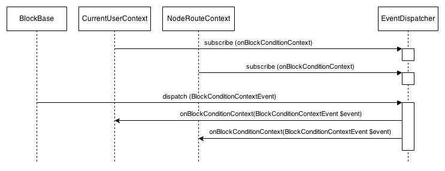

# Procedural to Object-Oriented Modules

Note: Welcome to Procedural to Object-Oriented Modules

---

## Who am I?

* Cameron Zemek (grom@pnx.me)
* Username (drupal, github, twitter): grom358
* 10 years in PHP
* Using drupal since version 4

Note: My name is Cameron Zemek, and I am a senior drupal developer at PreviousNext.
I have been working in PHP for almost 10 years now, and previous to that spent number of years in Java.

---

## Summary

* Refactoring procedural code into modern object oriented PHP
* Making Drupal 7 modules sympathetic to Drupal 8
* Common Drupal 8 Design Patterns
* Important changes in Drupal 8 that affect module development
* Tools to assist in conversion of Drupal 7 modules to Drupal 8
* Unit testing and mocking to drive higher quality code and faster development

Note: Today I am going to be talking about refactoring procedural code into object oriented code to improve quality and development and transition to drupal 8.
In doing so will cover some core drupal 8 design patterns and how we can leverage them in our own modules.
Also touch on some important changes to drupal 8 that will affect porting of modules and tools to help assist in this process.

---

## Getting off the island

* PHP 5.4 and shift from procedural to object-oriented programming
* Incorporation of external libraries (eg. Symfony)
* Less arrays and less drupalisms
* Lots of API clean up for greater consistency


Note: As I just eluded to and as you may be aware, Drupal 8 is making major architectural changes.
Shifting from procedural to object-oriented programming and taking advantage of the features in PHP 5.4 and excellent external libraries.
There is less drupalisms, or as I like to put it. We moving off the drupal island and heading to the PHP mainland. We are becoming a part of the larger PHP community and taking advantage of the excellent work that is done there instead of reinventing the wheel.
This also means we are contributing back to this projects and improving the PHP landscape for everyone.

---

## But don't be afraid


> If you learnt php from Drupal - Drupal 8 will teach you modern php from a familiar setting. (Lee Rowlands, 2014)

Note: For those that are not as familiar with object-oriented programming and grew up in drupal this change may seem daunting.
But as fellow drupaler Lee said, learning drupal 8 will teach you modern object-oriented PHP from a familiar setting.
In this session we are going to look at some examples of how we can refactor from procedural modules into object-oriented modules and make the transition to Drupal 8.
In doing so we will briefly cover common design patterns in Drupal 8 and how we can take advantage of them in our modules.

---

## Why Object-Oriented

* No more arrays with magic keys
* Clearly defined interfaces
* Pluggable components
* Separation of concerns
* Established design patterns
* Better testing

Note: Before we go into refactoring modules, you may be wondering what the big deal is, and why drupal is making these changes.
In my opinion it is making Drupal better designed. Instead of these arrays where you have to memorize what the keys are or go looking up the documentation we have interfaces.
An interface defines a contract for how we interact with a component and its more visible and has IDE support.
<ACTION> Show demo in PHPStorm of arrays vs object
Additionally interfaces gives us pluggable components. We are abstracted from a concrete implementation and can provide alternative implementations. For example, menu storage could be changed from using a tree to using nested set theory.
This also helps with testing as we can use a test double or what is referred to as a mock inplace of the component so can better test an individual part.
With this change to object-oriented programming we are seeing better separation of concerns. Drupal 8 is better supporting web services etc. No longer assuming the output is a HTML page.
Also taking advantage of established design patterns. Learning one part of drupal applies to many areas of drupal and even to other PHP projects. So its quicker for non drupal developers to get started on drupal and likewise for drupal developers to get started on other projects. That is more familiarity between PHP projects.

---

## Switch Witch

```
<?php
function example_block_info() {
  $blocks = array();
  $blocks['test-block'] = array(
    'info' => t('Test block'),
  );
  $blocks['another-test-block'] = array(
    'info' => t('Another test block'),
  );
  return $blocks;
}

function example_block_view($delta = '') {
  $block = array();
  switch ($delta) {
    case 'test-block':
      $block['subject'] = t('My test block');
      $block['content'] = t('An example block');
      break;
    case 'another-test-block':
      $block['subject'] = t('Yet another block');
      $block['content'] = t('Just a block');
      break;
  }
  return $block;
}
```

Note: Okay so lets look at an example of a drupal 7 module that is defining some blocks.
First thing to note is the Drupalism of hooks. We have to be careful in the naming of our functions so they match the required hook and the arguments align with how drupal will call our hook.
If we make a mistake in the function name of the hook we don't get any warnings or errors. There no immediate indication of mistake with the definition of the hook.
Second thing to note is we have these switch statements where the delta has to match what was returned in block_info.
If we to add other block hooks such as configuration forms we would be writing similiar switch statements.
So if we want to see everything relating to a single block we have to check for any hooks relating to blocks, then skim over the code looking for case or if statement that matches the delta of the block we are interested in.
This issue increases as the module gains more and more blocks, and even if we factor out each block into an include file we still have to deal with these switch statements.
Now lets take compare to the object oriented approach.

---

## Objects to the rescue

```
<?php
// Defined by core block module
interface BlockInterface {
  public function getBlockId();
  public function build();
  // Other methods omitted for brevity.
}

class BlockBase implements BlockInteface {
  // Omitted for brevity.
}

// Our module code
class TestBlock extends BlockBase {
 public function getBlockId() {
   return 'test-block';
 }
 
 public function build() {
   return $this->t('An example block');
 }
}
```

Note: So first thing to note is instead of hooks we have interfaces. The advantage of this is it more clearly defines what methods exist for blocks.
<Demo in phpstorm>
And with an IDE we are told when we implementing a method from the interface and it also check the arguments.
And we can easily find all blocks that have been defined. <Find Usages in phpstorm>
Secondly everything relating to an individual block is define in the one class which belongs in its own file. So now its much easier to work with an individual block.

---

## Bridging the gap

* http://www.previousnext.com.au/blog/drupal-8-now-writing-drupal-7-code-eye-towards-drupal-8
* https://www.drupal.org/project/ghost

```
<?php
class BlockPluginExample extends BlockPluginBase {
  public function blockInfo() {
    return array(
      'info' => t('Example block'),
    );
  }
 
  public function blockSubject() {
    return t('My test block');
  }
 
  public function blockContent() {
    return t('An example block');
  }
}

```

Note: The object-oriented example I just gave was of drupal 8. So the question is can we use object-oriented modules in drupal 7 that will be sympathetic to Drupal 8. That is porting the module to drupal 8 will be more straightforward and be of an object-oriented design.
The short answer is yes. Chris Skene from PreviousNext has recently published a module called Ghost that lets you use object-oriented pages, forms and blocks in Drupal 7.
This is similiar to the block code in Drupal 8. And so less changes will be required to transition the code to work on Drupal 8.

---

## Design Patterns

* A general reusable solution to a commonly occurring problem within a given context in software design.
* It is a description or template for how to solve a problem that can be used in many different situations.


Note: Now we have looked at basic example of changing a module from procedural to object-oriented lets look at some useful techniques that we can apply with object-oriented modules.
So what are design patterns?
A design pattern is a general reusable solution to a commonly occurring problem within a given context in software design.
The solution isn't a concrete implementation but a description or template on how to solve a problem that can be used in different situations.
These design patterns also apply outside of Drupal and are common in many object-oriented langauges.
So with Drupal 8 this means less drupalisms. The idea being once you learn something in Drupal 8 you can apply it in multiple situations.
So lets look at some of these design patterns and how they can be applied to our modules.

---

## Dependency Injection

* Pattern where one or more dependencies (or services) are injected (eg. passed by reference) into a dependent object (or client) and are made part of the client's state.
* It separates the creation of a client's dependcies from its own behavior
* Increases flexibility
* Increases testability

Note: Dependency injection is a software design pattern in which one or more dependencies (or services) are injected, for example passed by reference, into a dependent object (or client) and are made part of the client's state.
It separates the creation of a client's dependencies from its own behavior, which allows for loose coupling and helps to keep the class having only a single reponsibility.
This improves flexibility and testability because we can use swap the dependency. For example in unit testing we can use mock objects in the dependencies.

---

## Dependency Injection

```
<?php
class ClientExample {
  protected $database;

  public function __construct(Connection $database) {
    $this->database = $database;
  }

  public function someMethod() {
    $data = $this->database->query("SELECT myfield FROM mytable")->fetchCol();
    // perform calculation on data
    return $result;
  }
}
```

Note: So a classic example is requiring a database connection. We inject the dependency here by having the constructor have the dependency as an argument.
This allows us when testing to replace the connection with one to test database or better yet, a mock connection that doesn't implement a connection to database, but returns the data needed for the test. Doing this allows us to test the calculation logic in isolation and not test the dependent components such as the database. This gives us greater confidence that this class is correct. 

---

## Factory Pattern 

* A factory is an object or method for creating objects.
* Decouples the code from specific classes.


Note: In php, a factory is the abstraction for the creation of an object. A constructor results in an object of concrete class, so by having our dependent class using the new keyword to create the class its coupled with that specific class and is also adding responsibility to the class that is outside its behaviour. By using the factory pattern we can decouple from using concrete classes. Let's take a look at using a factory method in drupal 8.

---

## Factory Method Pattern

```
<?php
class BlockContentForm extends ContentEntityForm {
  public function __construct(
    EntityManagerInterface $entity_manager,
    EntityStorageInterface $block_content_storage,
    LanguageManager $language_manage
  ) {
    parent::__construct($entity_manager);
    $this->blockContentStorage = $block_content_storage;
    $this->languageManager = $language_manager;
  }

  public static function create(ContainerInterface $container) {
    $entity_manager = $container->get('entity.manager');
    return new static(
      $entity_manager,
      $entity_manager->getStorage('block_content'),
      $container->get('language_manager')
    );
  }
}
```

Note: Here we using factory method in conjunction with dependency injection. This is used throughout Drupal 8. Notice the factory method takes a ContainerInterface. The container is responsible for the assembly of objects and is controlled via YAML files.
<Show core.services.yml in phpstorm>


---

## Mediator pattern

* The essence of the Mediator Pattern is to "Define an object that encapsulates how a set of objects interact"
* Mediator promotes loose coupling by keeping objects from referring to each other explicitly.
* Drupal 8 event system follows this pattern http://goo.gl/3uPKMx



Note: The essence of the Mediator Pattern is to "Define an object that encapsulates how a set of objects interact"
With this pattern, communication between objects is encapsulated with a mediator object. Objects no longer communicate directly with each other, but instead communicate through the mediator. This reduces the dependencies between communicating objects, thereby lowering the coupling.
In Drupal 8 the event system uses the mediator pattern to decouple classes that generate events from classes that interact on these events.
We register interest inn events by implementing the EventSubscriberInterface which has the getSubscribedEvents method that returns the events interested in and the callback to call for these events. Then classes such as BlockBase dispatch events to the EventDispatcher which then takes care of notifying listeners such as CurrentUserContext and NodeRouteContext of these events.

---

## Unit testing

* Goal is to isolate each part (unit) and show that the individual part is correct.
* Provides a strict, written contract that the part must satisfy
* Benefits:
  * Finds problems early
  * Facilitates change
  * Simplifies integration
  * Documentation
  * Better Design
  
Note: The general theme of these design patterns is they reduce coupling of dependencies. This really helps with testibility and therefore improves quality as we can test and verify each part in isolation.
By writing unit tests we gain a strict written contract that the part must satisfy. We have a repeatable and provable set of functionality which provide a number of benefits.
Unit tests should be ran frequently and since they testing individual part they detect errors at early stage.
And with a repeatable automated test suite it opens up the possibility to refactor code and check that the module still works correctly.
It simplifies integration as we reduce uncertainty with the invidiual parts and so integration testing becomes much easier since there is less surface area.
Unit tests act as a sort of living documentation. Its in sync with the functionality of the code and it describes in detail the functionality that is provided.
The process of creating unit tests also helps improve our design. When something is difficult to test it means our design needs improving. So the unit tests drives use to use better designs so the code is testable.

---

## Mocking

```
<?php
class AlaramTest extends PHPUnit_Framework_TestCase {
  public function testRadioWakeup() {
    $stub = $this->getMock('Clock');
    $stub->method('getTime')
      ->willReturn(Time::fromString('6:00 AM'));

    $alarmClock = new AlarmClock($stub);

    $this->assertTrue($alarmClock->isWakeup());
    $this->assertTrue($alarmClock->isRadioPlaying());
  }
}
```

Note: Objects may have a number of dependencies so how can we test it in isolation. The answer is we can use a mock object that simulates the behavior of real objects in a controlled way. This is in much the same way that car designers use a crash test dummy to simulate vehicle impacts.
This is useful when the dependency has any number of characteristics such as:
* Its results are non-deterministic (eg. the current temperature)
* It has states that are difficult to create or reproduce (eg. a network error)
* It is slow (eg. a database)
* It does not exist yet

For example, an alarm clock which causes the radio to start playing at certain time. To test this, we create a mock object that provides the alarm time whether it is actually that time or not.

---

## Important Changes in Drupal 8

* http://www.previousnext.com.au/blog/drupal-south-presentation-everything-you-wanted-know-about-drupal-8-were-too-afraid-ask
* Utility class methods in preference to functions. Eg. String::checkPlain instead of check_plain
* hook_menu is gone, replaced by routes
* variable_set / variable_get is replaced with a configuration system

```
<?php
$config = \Drupal::config('forum.settings');
$vocabulary = $config->get('vocabulary');
$config->set('vocabulary', 'hooha')->save();
```

Note: There are lot of changes with Drupal 8 and unfortunately we don't have time to cover them in this session. If you want to know more about the changes I highly recommend the talk 'Everything you wanted to know about Drupal 8 but were too afraid to ask' by Lee Rowlands and Kim Pepper.
However I will cover a couple of the changes here. Firstly there is a preference to use utility class methods instead of utility functions. For example checkPlain static method on String class instead of the global check_plain. Basically there is less population of the global namespace in Drupal 8. Its still a work in progress however.
A bigger change that will affect your modules is hook_menu is gone and been replaced by routes. And variable_set and get have been replaced with a proper configuration system.

---

## Routing Pages

Two easy steps:

1. Create a page controller by extending ControllerBase
2. Create route definition in module_name.routing.yml

Note: So with routes we define our pages in two easy steps. We create our page controlelr by extending ControllerBase, then we create our route definition in a YAML file.

---

## Routing Pages

```
<?php
namespace Drupal\page_example\Controller;

use Drupal\Core\Controller\ControllerBase;

class PageExampleController extends ControllerBase {
  public function pageExample() {
    return array(
      '#markup' => $this->t('This is some content'),
    );
  }
}
```

Note: Similiar to the block example from earlier we have object-oriented pages. The methods on this controller class replace the page callbacks that we defined in Drupal 7.
Note: Just quick now here. Functions such as t function are now methods on the ControllerBase. So we have $this->t instead of calling a global t function.

---

## Routing pages

```
page_example.example:
  path: 'examples/page_example'
  defaults:
    _content: '\Drupal\page_example\Controller\PageExampleController::pageExample'
  requirements:
    _permission: 'access examples'
```

Note: Now we have a YAML configuration file that defines the mapping of a path back to our controller method. By using an id for the route the code is not dependent on the path, this lets us hot-swap paths. How awesome is that!
There is more routes can do compared to hook_menu but I just wanted to show a quick example of how you can define a page. Check out Lee and Kim's talk if you want to find out more.

---

## Drupal Module Upgrader

* https://www.drupal.org/project/drupalmoduleupgrader
* Developed by Acquia
* Detect old D7 code and flag errors which point people off to the relevant change notice(s).
* The goal is to hit the most widely-used hooks and ensure there's detection logic for them.

Note: To help migrate modules from Drupal 7 to 8, Acquia have created Drupal Module Upgrader. It will help detect old drupal 7 code and flag errors that point to the relevant change notice. The goal is to detect the most widely-used hooks and give you information about them.

---

## Pharborist

* http://www.previousnext.com.au/blog/dom-php
* Provides a jQuery insipired library for PHP source trees
* Example usages:
  * Conversion of procedural function calls to utility function https://github.com/grom358/d8codetools
  * Array syntax upgrade http://www.previousnext.com.au/blog/upgrade-array-syntax-automatic-way

Note: Another tool that you may find useful is one I have developed called Pharborist. Its a library that provides a jQuery inspired interface for working with PHP source trees. Its still in its infancy but I would like to see tools like Drupal Module Upgrader and php-cs fixer using it in the future.
So far its been used to create a number of patches to convert procedural function calls to the class utility method. Eg. check_plain patch was created by the tool I have on github there.
I have also blogged showing an example of using it to upgrade from old array syntax to the new style.


---

## Pharborist

```
<?php
foreach ($tree->find(Filter::isInstanceOf('\Pharborist\ArrayNode')) as $array) {
  // Test if using old syntax.
  if ($array->firstChild()->getText() === 'array') {
    // Remove any hidden tokens between T_ARRAY and ( .
    $array->firstChild()->nextUntil(function (Node $node) {
      return $node instanceof TokenNode && $node->getType() === '(';
    })->remove();
    $array->firstChild()->remove(); // remove T_ARRAY token.
    $array->firstChild()->replaceWith(new TokenNode('[', '[')); // replace ( with [ .
    $array->lastChild()->replaceWith(new TokenNode(']', ']')); // replace ) with ] .
  }
}
```

Note: Here is snippet of the code from that blog to show you Pharborist in action. The PHP source is constructed into a tree which can then navigate via jQuery like methods. So we find arrays in the tree and foreach one we test if its in the old syntax and if so we convert it into the new syntax.
Its still rather early days for this library so shamelessly plugging it here, hoping to gain some more interest and feedback on it.

---

## Questions